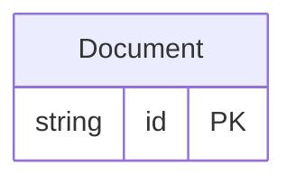

<!-- Code generated by protoc-gen-store. DO NOT EDIT. -->

# `v1` — PostgreSQL schema

CREATE SCHEMA / TYPE / TABLE DDL with foreign keys and indexes.

Generated from Protobuf by protoc-gen-store. Source of truth is the `.proto` files — regenerate rather than editing.

| Models | Enums |
| ---: | ---: |
| 1 | 0 |

## Entity relationships

## Output

- `migrate.sql` — the whole database in one transactional file; apply with `psql -f migrate.sql`.
- `<schema>.postgres.sql` — one DDL file per schema (apply referenced tables before referencing ones).
- Auto-update triggers keep updated-at columns current; COMMENT ON persists field docs to the catalog.

## Schema `aip_v1`

### `Document` → `documents`

Document exercises the AIP-148/164 system fields: create_time/update_time become auto-managed audit timestamps, delete_time a nullable indexed soft-delete marker, and uid a UNIQUE server-assigned id — all with no orm annotation.

| Column | Type | Null |
| --- | --- | --- |
| `id` | `CHAR(26)` | not null |
| `name` | `VARCHAR(255)` | not null |
| `uid` | `VARCHAR(255)` | nullable |
| `title` | `VARCHAR(255)` | not null |
| `create_time` | `TIMESTAMPTZ` | not null |
| `update_time` | `TIMESTAMPTZ` | not null |
| `delete_time` | `TIMESTAMPTZ` | nullable |
