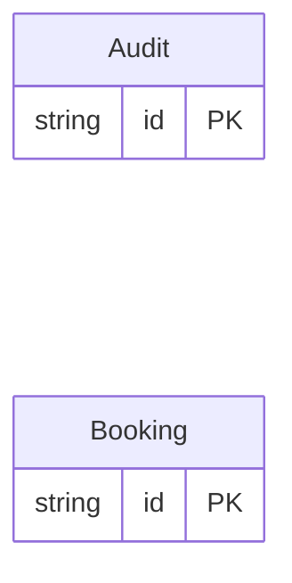

<!-- Code generated by protoc-gen-orm. DO NOT EDIT. -->

# `hotel_db` — GORM models

Go structs with GORM struct tags — one package per schema.

Generated from Protobuf by protoc-gen-orm. Source of truth is the `.proto` files — regenerate rather than editing.

| Models | Enums |
| ---: | ---: |
| 2 | 0 |

## Entity relationships

## Output

- `<schema>/models.go` — one Go package per schema, one struct per table.
- `migrate.go` — a factory `Registry` (with a preloaded `Default`) that migrates every model in one call; emitted when the `go_module` opt is set. Call `Default.EnsureSchemas(db)` before `Default.Migrate(db)` so the schema-qualified tables have their Postgres schemas.
- Nullable columns are pointer types; proto enums become string-typed Go enums.
- Attach in main: `Default.EnsureSchemas(db)` then `Default.Migrate(db)`, or wire the structs into a `*gorm.DB` and run AutoMigrate yourself.
- `<schema>/<model>_store.go` — a typed CRUD store per resource (Create, GetByID, List, Count, Update, DeleteByID, plus GetBy/ListBy finders for unique and foreign-key columns); emitted when the `stores` opt is set (which also requires `go_module`). Requires `gorm.io/gorm`.
- `gormx/gormx.go` — the shared runtime every store imports: `ListOptions`, the generic `Store[M]` interface every store satisfies, a `GenericStore[M]` engine that runs CRUD for any model with no per-entity code, and `EnsureSchemas`. Lets one generic engine drive every entity.

## Schema `hotel`

### `Booking` → `bookings`

Booking is the read-heavy resource the cache exists for: a booking is fetched by id constantly and listed by hotel and date range on every availability check, while writes are comparatively rare.

| Column | Type | Null |
| --- | --- | --- |
| `id` | `CHAR(26)` | not null |
| `name` | `VARCHAR(255)` | not null |
| `hotel_id` | `VARCHAR(255)` | not null |
| `check_in` | `VARCHAR(255)` | not null |
| `check_out` | `VARCHAR(255)` | not null |
| `guests` | `INTEGER` | nullable |

### `Audit` → `audits`

Audit carries no cache policy, proving a table in a cache-enabled tree gets no Cache field and no invalidation when it declares none.

| Column | Type | Null |
| --- | --- | --- |
| `id` | `CHAR(26)` | not null |
| `name` | `VARCHAR(255)` | not null |
| `note` | `VARCHAR(255)` | nullable |

## Cache policy

Declared with `(orm.v1.cache)`. This is policy metadata: the schema states
which lookups are worth caching and what makes them stale. No cache client,
key builder, or stream consumer is generated from it — the contract is pinned
here so a runtime can implement it without re-deciding it.

| Model | TTL | Strategy | Invalidation | Keys | Stream |
| --- | --- | --- | --- | --- | --- |
| Booking | 5m0s | read-through | stream | `hotel.bookings/id` (id) | `hotel.bookings.>` (durable `bookings-cache`) |
