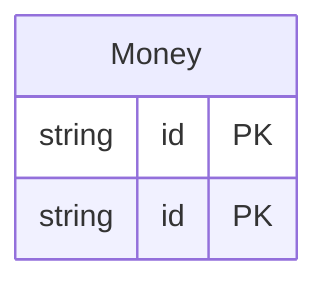

<!-- Code generated by protoc-gen-store. DO NOT EDIT. -->

# `commerce` — GORM models

Go structs with GORM struct tags — one package per schema.

Generated from Protobuf by protoc-gen-store. Source of truth is the `.proto` files — regenerate rather than editing.

| Models | Enums |
| ---: | ---: |
| 2 | 2 |

## Entity relationships

## Output

- `<schema>/models.go` — one Go package per schema, one struct per table.
- `migrate.go` — a factory `Registry` (with a preloaded `Default`) that migrates every model in one call; emitted when the `go_module` opt is set. Call `Default.EnsureSchemas(db)` before `Default.Migrate(db)` so the schema-qualified tables have their Postgres schemas.
- Nullable columns are pointer types; proto enums become string-typed Go enums.
- Attach in main: `Default.EnsureSchemas(db)` then `Default.Migrate(db)`, or wire the structs into a `*gorm.DB` and run AutoMigrate yourself.

## Schema `shop_cart_v1`

### `Money` → `moneys`

Money is a cart-side resource. Its simple name "Money" collides with the order-side Money once both packages merge into the "commerce" database (see store.yaml). Prisma qualifies the colliding model names (its models share one global namespace), while the schema-namespaced targets — GORM (one package per schema), SQL, and CSV — keep the bare "Money", since the schema already disambiguates them.

| Column | Type | Null |
| --- | --- | --- |
| `id` | `CHAR(26)` | not null |
| `name` | `VARCHAR(255)` | not null |
| `amount` | `BIGINT` | not null |
| `status` | `Status` | not null |

### Enums

- `Status`: PENDING, PAID

## Schema `shop_order_v1`

### `Money` → `moneys`

Money is the order-side resource sharing the simple name "Money" with the cart-side one. See cart.proto for how each target renders the collision.

| Column | Type | Null |
| --- | --- | --- |
| `id` | `CHAR(26)` | not null |
| `name` | `VARCHAR(255)` | not null |
| `amount` | `BIGINT` | not null |
| `status` | `Status` | not null |

### Enums

- `Status`: SHIPPED, DELIVERED
