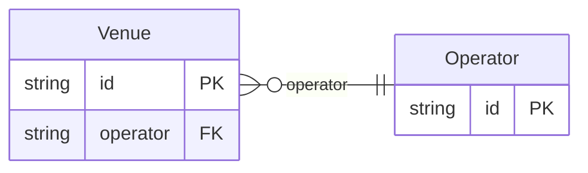

<!-- Code generated by protoc-gen-store. DO NOT EDIT. -->

# `v1/filters/` — Prisma schema

Generated from Protobuf by protoc-gen-store. Source of truth is the `.proto` files — regenerate rather than editing.

| Models | Enums |
| ---: | ---: |
| 2 | 1 |

## Entity relationships

Schema file: [`filters.postgres.prisma`](./filters.postgres.prisma)

### `Venue` → `venues`

Venue exercises the filters emitter: type-derived kinds for every scalar shape (text, enum, date, timestamp, int, bool, tags), the search opt-in, the filterable/sortable opt-outs, a resource reference (equality-only Ref kind), and shapes that are always excluded (JSONB attributes, the synthesized key).

| Column | Type | Null |
| --- | --- | --- |
| `id` | `CHAR(26)` | not null |
| `name` | `VARCHAR(255)` | not null |
| `display_name` | `VARCHAR(255)` | not null |
| `operator` | `CHAR(26)` | not null |
| `kind` | `VenueKind` | not null |
| `capacity` | `INTEGER` | nullable |
| `open_air` | `BOOLEAN` | nullable |
| `licence_expiry` | `DATE` | nullable |
| `tags` | `VARCHAR(255)[]` | nullable |
| `internal_code` | `VARCHAR(255)` | nullable |
| `nonce` | `VARCHAR(255)` | nullable |
| `attributes` | `JSONB` | nullable |
| `create_time` | `TIMESTAMPTZ` | not null |

### `Operator` → `operators`

Operator is the referenced parent so the venue's reference resolves to a real table (a hard FK) instead of degrading to a soft reference.

| Column | Type | Null |
| --- | --- | --- |
| `id` | `CHAR(26)` | not null |
| `name` | `VARCHAR(255)` | not null |
| `display_name` | `VARCHAR(255)` | not null |

### Enums

- `VenueKind`: HALL, ARENA
