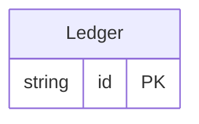

<!-- Code generated by protoc-gen-store. DO NOT EDIT. -->

# `licence_db` — GORM models

Go structs with GORM struct tags — one package per schema.

Generated from Protobuf by protoc-gen-store. Source of truth is the `.proto` files — regenerate rather than editing.

| Models | Enums |
| ---: | ---: |
| 1 | 0 |

## Entity relationships

## Output

- `<schema>/models.go` — one Go package per schema, one struct per table.
- `migrate.go` — a factory `Registry` (with a preloaded `Default`) that migrates every model in one call; emitted when the `go_module` opt is set. Call `Default.EnsureSchemas(db)` before `Default.Migrate(db)` so the schema-qualified tables have their Postgres schemas.
- Nullable columns are pointer types; proto enums become string-typed Go enums.
- Attach in main: `Default.EnsureSchemas(db)` then `Default.Migrate(db)`, or wire the structs into a `*gorm.DB` and run AutoMigrate yourself.

## Schema `public`

### `Ledger` → `ledgers`

Ledger exists to put one table in front of every renderer, so the goldens show the licence block the case's license_header marker sets: above the banner, separated by a blank line, and carried in each target's own comment syntax — "//" for the gorm models and the Prisma schema, "--" for the DDL.

| Column | Type | Null |
| --- | --- | --- |
| `id` | `CHAR(26)` | not null |
| `name` | `VARCHAR(255)` | not null |
| `balance` | `BIGINT` | nullable |
