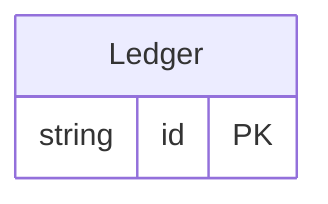

<!-- Code generated by protoc-gen-store. DO NOT EDIT. -->

# `licence_db/licenseheader/` — Prisma schema

Generated from Protobuf by protoc-gen-store. Source of truth is the `.proto` files — regenerate rather than editing.

| Models | Enums |
| ---: | ---: |
| 1 | 0 |

## Entity relationships

Schema file: [`licenseheader.postgres.prisma`](./licenseheader.postgres.prisma)

### `Ledger` → `ledgers`

Ledger exists to put one table in front of every renderer, so the goldens show the licence block the case's license_header marker sets: above the banner, separated by a blank line, and carried in each target's own comment syntax — "//" for the gorm models and the Prisma schema, "--" for the DDL.

| Column | Type | Null |
| --- | --- | --- |
| `id` | `CHAR(26)` | not null |
| `name` | `VARCHAR(255)` | not null |
| `balance` | `BIGINT` | nullable |
