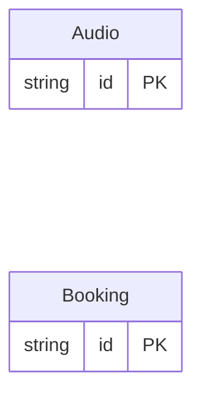

<!-- Code generated by protoc-gen-store. DO NOT EDIT. -->

# `v1` — GORM models

Go structs with GORM struct tags — one package per schema.

Generated from Protobuf by protoc-gen-store. Source of truth is the `.proto` files — regenerate rather than editing.

| Models | Enums |
| ---: | ---: |
| 2 | 2 |

## Entity relationships

## Output

- `<schema>/models.go` — one Go package per schema, one struct per table.
- `migrate.go` — a factory `Registry` (with a preloaded `Default`) that migrates every model in one call; emitted when the `go_module` opt is set. Call `Default.EnsureSchemas(db)` before `Default.Migrate(db)` so the schema-qualified tables have their Postgres schemas.
- Nullable columns are pointer types; proto enums become string-typed Go enums.
- Attach in main: `Default.EnsureSchemas(db)` then `Default.Migrate(db)`, or wire the structs into a `*gorm.DB` and run AutoMigrate yourself.

## Schema `oneof_v1`

### `Audio` → `audios`

Audio exercises oneof integrity: the `input` oneof flattens to independent nullable columns, and store adds a generated input_case discriminator enum recording which member is set so the lost exclusivity invariant is observable.

| Column | Type | Null |
| --- | --- | --- |
| `id` | `CHAR(26)` | not null |
| `name` | `VARCHAR(255)` | not null |
| `audio_data` | `BYTEA` | nullable |
| `upload_path` | `VARCHAR(255)` | nullable |
| `live_pipeline_file_path` | `VARCHAR(255)` | nullable |
| `sample_rate` | `INTEGER` | nullable |
| `input_case` | `AudioInputCase` | nullable |

### `Booking` → `bookings`

Booking pins the RFC 7953 shape: well-known types as oneof members. These have no struct field of their own — protoc-gen-go puts each behind a wrapper on the oneof's interface field — so the converters must emit `out.EndForm = &Booking_Duration{Duration: …}`, not `out.Duration = …`. The enum arm is here for the same reason: it is a value type, so it guards on the zero rather than on nil. Without converters emitted for this message the flat form compiles here and fails only in a consumer's tree.

| Column | Type | Null |
| --- | --- | --- |
| `id` | `CHAR(26)` | not null |
| `name` | `VARCHAR(255)` | not null |
| `end` | `TIMESTAMPTZ` | nullable |
| `duration` | `INTERVAL` | nullable |
| `end_form_case` | `BookingEndFormCase` | nullable |

### Enums

- `AudioInputCase`: AUDIO_DATA, UPLOAD_PATH, LIVE_PIPELINE_FILE_PATH
- `BookingEndFormCase`: END, DURATION
