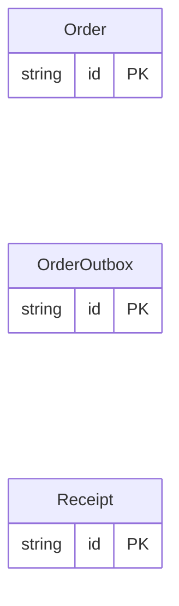

<!-- Code generated by protoc-gen-store. DO NOT EDIT. -->

# `shop_db/outbox/` — Prisma schema

Generated from Protobuf by protoc-gen-store. Source of truth is the `.proto` files — regenerate rather than editing.

| Models | Enums |
| ---: | ---: |
| 3 | 0 |

## Entity relationships

Schema file: [`outbox.postgres.prisma`](./outbox.postgres.prisma)

### `Order` → `orders`

Order opts into an outbox. Its ULID primary key is what aggregate_id is typed against, so the companion's foreign reference matches the key strategy rather than assuming a string.

| Column | Type | Null |
| --- | --- | --- |
| `id` | `CHAR(26)` | not null |
| `name` | `VARCHAR(255)` | not null |
| `total` | `BIGINT` | not null |
| `created_at` | `TIMESTAMPTZ` | not null |
| `updated_at` | `TIMESTAMPTZ` | not null |

### `Receipt` → `receipts`

Receipt does not opt in, so no receipts_outbox table is generated.

| Column | Type | Null |
| --- | --- | --- |
| `id` | `CHAR(26)` | not null |
| `name` | `VARCHAR(255)` | not null |

### `OrderOutbox` → `orders_outbox`

Transactional outbox for Order: change events written in the same transaction as the row they describe.

| Column | Type | Null |
| --- | --- | --- |
| `id` | `CHAR(26)` | not null |
| `aggregate_id` | `CHAR(26)` | not null |
| `event_type` | `VARCHAR(255)` | not null |
| `payload` | `JSONB` | not null |
| `created_at` | `TIMESTAMPTZ` | not null |
| `published_at` | `TIMESTAMPTZ` | nullable |
