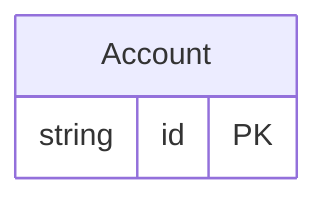

<!-- Code generated by protoc-gen-store. DO NOT EDIT. -->

# `reserved_db/` — Prisma schema

Generated from Protobuf by protoc-gen-store. Source of truth is the `.proto` files — regenerate rather than editing.

| Models | Enums |
| ---: | ---: |
| 1 | 1 |

## Entity relationships

## Subfolders

- [`reserved_words/`](./reserved_words/README.md)
