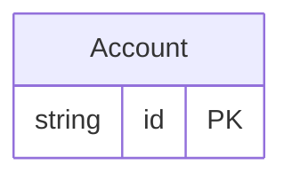

<!-- Code generated by protoc-gen-store. DO NOT EDIT. -->

# `reserved_db/reserved_words/` — Prisma schema

Generated from Protobuf by protoc-gen-store. Source of truth is the `.proto` files — regenerate rather than editing.

| Models | Enums |
| ---: | ---: |
| 1 | 1 |

## Entity relationships

Schema file: [`reserved_words.postgres.prisma`](./reserved_words.postgres.prisma)

### `Account` → `user`

Account is forced onto the reserved table name "user" via a table override, with reserved-word columns, a composite UNIQUE index over them, and column-level index requests both covered and uncovered by that composite.

| Column | Type | Null |
| --- | --- | --- |
| `id` | `CHAR(26)` | not null |
| `name` | `VARCHAR(255)` | not null |
| `order` | `VARCHAR(255)` | nullable |
| `select` | `VARCHAR(255)` | nullable |
| `grant` | `VARCHAR(255)` | nullable |
| `state` | `State` | nullable |

### Enums

- `State`: ACTIVE, CLOSED
