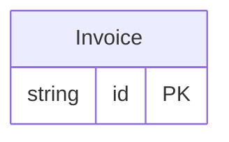

<!-- Code generated by protoc-gen-store. DO NOT EDIT. -->

# `billing_db` — PostgreSQL schema

CREATE SCHEMA / TYPE / TABLE DDL with foreign keys and indexes.

Generated from Protobuf by protoc-gen-store. Source of truth is the `.proto` files — regenerate rather than editing.

| Models | Enums |
| ---: | ---: |
| 1 | 0 |

## Entity relationships

## Output

- `migrate.sql` — the whole database in one transactional file; apply with `psql -f migrate.sql`.
- `<schema>.postgres.sql` — one DDL file per schema (apply referenced tables before referencing ones).
- Auto-update triggers keep updated-at columns current; COMMENT ON persists field docs to the catalog.

## Schema `acme_billing`

### `Invoice` → `invoices`

Invoice lands in schema "acme_billing", not "acme_billing_v1": the store.yaml strip_version option flattens the trailing API version out of the resource-type-derived schema name.

| Column | Type | Null |
| --- | --- | --- |
| `id` | `CHAR(26)` | not null |
| `name` | `VARCHAR(255)` | not null |
| `amount` | `VARCHAR(255)` | not null |
