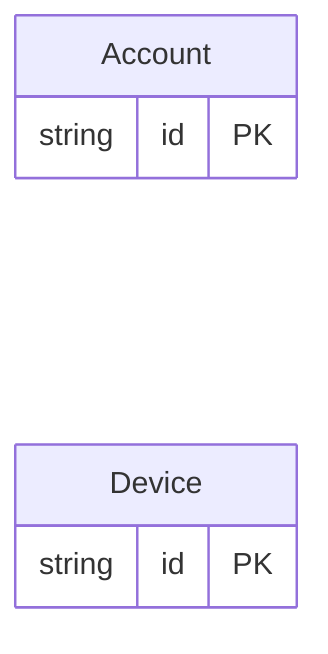

<!-- Code generated by protoc-gen-orm. DO NOT EDIT. -->

# `profile_db` — GORM models

Go structs with GORM struct tags — one package per schema.

Generated from Protobuf by protoc-gen-orm. Source of truth is the `.proto` files — regenerate rather than editing.

| Models | Enums |
| ---: | ---: |
| 2 | 0 |

## Entity relationships

## Output

- `<schema>/models.go` — one Go package per schema, one struct per table.
- `migrate.go` — a factory `Registry` (with a preloaded `Default`) that migrates every model in one call; emitted when the `go_module` opt is set. Call `Default.EnsureSchemas(db)` before `Default.Migrate(db)` so the schema-qualified tables have their Postgres schemas.
- Nullable columns are pointer types; proto enums become string-typed Go enums.
- Attach in main: `Default.EnsureSchemas(db)` then `Default.Migrate(db)`, or wire the structs into a `*gorm.DB` and run AutoMigrate yourself.
- `<schema>/models.go` also carries a `Validate() error` per model with an `(orm.v1.validate)` preset, returning a `validatex.Violations` that names every offending column; the generated stores call it before `Create`/`Update`.
- `validatex/validatex.go` — the shared validation predicates the `Validate` methods call. Standard library only, so validation adds no dependency to your build. Emitted with the `validation` opt (which also requires `go_module`).
- Columns carrying a DB-expressible preset also get a `CHECK` constraint via their GORM `check:` tag, named to match the one the `sql` target's DDL creates, so `AutoMigrate` and the DDL agree.
- `<schema>/<model>_store.go` — a typed CRUD store per resource (Create, GetByID, List, Count, Update, DeleteByID, plus GetBy/ListBy finders for unique and foreign-key columns); emitted when the `stores` opt is set (which also requires `go_module`). Requires `gorm.io/gorm`.
- `gormx/gormx.go` — the shared runtime every store imports: `ListOptions`, the generic `Store[M]` interface every store satisfies, a `GenericStore[M]` engine that runs CRUD for any model with no per-entity code, and `EnsureSchemas`. Lets one generic engine drive every entity.

## Schema `profile`

### `Account` → `accounts`

Account exercises every projection the validation presets have: stacked presets on one field, the nil-guard an optional column needs, numeric and temporal and repeated presets, a preset whose SQL form repeats the column reference, and a preset with no SQL form at all.

| Column | Type | Null |
| --- | --- | --- |
| `id` | `CHAR(26)` | not null |
| `name` | `VARCHAR(255)` | not null |
| `email` | `VARCHAR(255)` | not null |
| `website` | `VARCHAR(255)` | nullable |
| `credits` | `INTEGER` | not null |
| `sku` | `VARCHAR(255)` | nullable |
| `tier` | `VARCHAR(255)` | not null |
| `bio` | `VARCHAR(255)` | nullable |
| `handle` | `VARCHAR(255)` | not null |
| `born_at` | `TIMESTAMPTZ` | nullable |
| `tags` | `VARCHAR(255)[]` | nullable |

### `Device` → `devices`

Device carries no presets at all, proving a table in a validated tree emits no Validate method and no store write-path call when nothing is annotated.

| Column | Type | Null |
| --- | --- | --- |
| `id` | `CHAR(26)` | not null |
| `name` | `VARCHAR(255)` | not null |
| `label` | `VARCHAR(255)` | nullable |

## Cache policy

Declared with `(orm.v1.cache)`. This is policy metadata: the schema states
which lookups are worth caching and what makes them stale. No cache client,
key builder, or stream consumer is generated from it — the contract is pinned
here so a runtime can implement it without re-deciding it.

| Model | TTL | Strategy | Invalidation | Keys | Stream |
| --- | --- | --- | --- | --- | --- |
| Account | 5m0s | read-through | stream | `profile.accounts/id` (id) `cache_accounts_by_handle` (handle) | `profile.accounts.>` (durable `accounts-cache`) |
