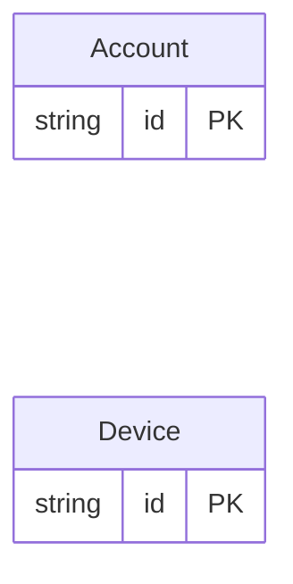

<!-- Code generated by protoc-gen-orm. DO NOT EDIT. -->

# `profile_db` — PostgreSQL schema

CREATE SCHEMA / TYPE / TABLE DDL with foreign keys and indexes.

Generated from Protobuf by protoc-gen-orm. Source of truth is the `.proto` files — regenerate rather than editing.

| Models | Enums |
| ---: | ---: |
| 2 | 0 |

## Entity relationships

## Output

- `migrate.sql` — the whole database in one transactional file; apply with `psql -f migrate.sql`.
- `<schema>.postgres.sql` — one DDL file per schema (apply referenced tables before referencing ones).
- Auto-update triggers keep updated-at columns current; COMMENT ON persists field docs to the catalog.

## Schema `profile`

### `Account` → `accounts`

Account exercises every projection the validation presets have: stacked presets on one field, the nil-guard an optional column needs, numeric and temporal and repeated presets, a preset whose SQL form repeats the column reference, and a preset with no SQL form at all.

| Column | Type | Null |
| --- | --- | --- |
| `id` | `CHAR(26)` | not null |
| `name` | `VARCHAR(255)` | not null |
| `email` | `VARCHAR(255)` | not null |
| `website` | `VARCHAR(255)` | nullable |
| `credits` | `INTEGER` | not null |
| `sku` | `VARCHAR(255)` | nullable |
| `tier` | `VARCHAR(255)` | not null |
| `bio` | `VARCHAR(255)` | nullable |
| `handle` | `VARCHAR(255)` | not null |
| `born_at` | `TIMESTAMPTZ` | nullable |
| `tags` | `VARCHAR(255)[]` | nullable |

### `Device` → `devices`

Device carries no presets at all, proving a table in a validated tree emits no Validate method and no store write-path call when nothing is annotated.

| Column | Type | Null |
| --- | --- | --- |
| `id` | `CHAR(26)` | not null |
| `name` | `VARCHAR(255)` | not null |
| `label` | `VARCHAR(255)` | nullable |
